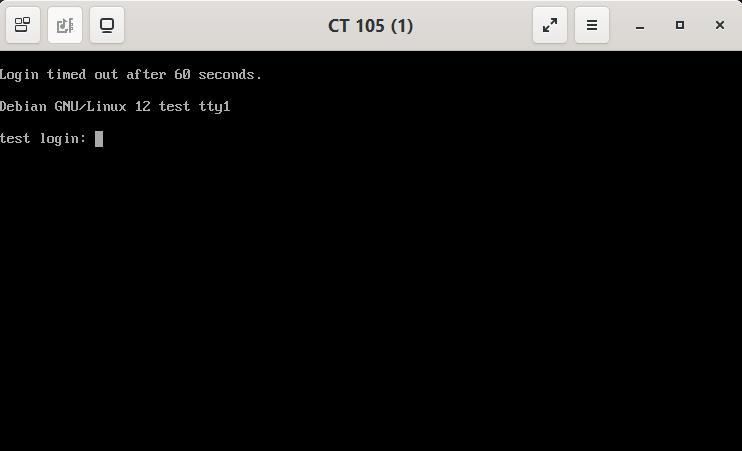
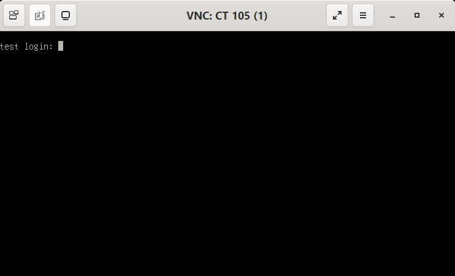

#  cv4pve-pepper

```
     ______                _                      __
    / ____/___  __________(_)___ _   _____  _____/ /_
   / /   / __ \/ ___/ ___/ / __ \ | / / _ \/ ___/ __/
  / /___/ /_/ / /  (__  ) / / / / |/ /  __(__  ) /_
  \____/\____/_/  /____/_/_/ /_/|___/\___/____/\__/

Launching SPICE/VNC Remote Viewer for Proxmox VE (Made in Italy)
```

[](LICENSE.md)
[](https://github.com/Corsinvest/cv4pve-pepper/releases/latest)
[](https://github.com/Corsinvest/cv4pve-pepper/releases)
[](https://winstall.app/apps/Corsinvest.cv4pve.pepper)
[](https://aur.archlinux.org/packages/cv4pve-pepper)

> **The console of any Proxmox VE VM, one command away**: SPICE or VNC, straight into `remote-viewer`, from your desktop, a script or a shortcut.
>
> **[Documentation](https://corsinvest.github.io/cv4pve-pepper/)**
>
> Prefer to pick your VMs from a list? [cv4pve-vdi](https://github.com/Corsinvest/cv4pve-vdi) is the desktop application built on the same console code.

---

## Why

Opening a console in Proxmox VE means logging in to the web interface, finding the VM, clicking *Console*, or downloading a `.vv` file for SPICE and opening it before its ticket expires. Fine once; tedious when the same people open the same VMs every day, and impossible to put on a desktop icon.

cv4pve-pepper does all of it in one command: it finds the VM or container by id or name, starts it if you ask, gets the console ticket and opens `remote-viewer`. Turn it into a desktop shortcut and a console is **one double-click away**, without giving anyone the web interface.

It **runs on your computer and uses only the Proxmox VE API**: nothing to install on the cluster, no SSH.

---

## One command. Any VM. SPICE or VNC.

```bash
# SPICE
cv4pve-pepper --host=pve01 --api-token='pepper@pve!console=<uuid>' --vmid=webserver --viewer=/usr/bin/remote-viewer

# VNC: add --vnc
cv4pve-pepper --host=pve01 --api-token='pepper@pve!console=<uuid>' --vmid=webserver --viewer=/usr/bin/remote-viewer --vnc
```

| SPICE | VNC |
|---|---|
|  |  |

SPICE for the full desktop experience, VNC for every running VM and container: [which one to use](https://corsinvest.github.io/cv4pve-pepper/spice-and-vnc/).

---

## Features

- **SPICE or VNC**: SPICE with audio, USB and clipboard when the VM is set up for it; VNC on every running VM and container, with no display setting to change.
- **VNC through the API port**: the console travels inside the API connection on port 8006: nothing else to open in the firewall.
- **By id or by name**: the same command keeps working when the VM migrates to another node.
- **Starts it for you**: `--start-or-resume` starts a stopped guest or resumes a paused one, then opens the console.
- **One icon per VM**: a parameter file and a desktop shortcut, on Windows and Linux; no console window on Windows.
- **Keeps working with a node down**: give it more than one host and it uses the first that answers.
- **Single self-contained binary**: Windows, Linux and macOS, nothing else to install besides `remote-viewer`.

---

## Quick start

```bash
# Windows
winget install Corsinvest.cv4pve.pepper
winget install RedHat.VirtViewer

# Linux (other platforms and packages: see the documentation)
wget https://github.com/Corsinvest/cv4pve-pepper/releases/latest/download/cv4pve-pepper-linux-x64.zip
unzip cv4pve-pepper-linux-x64.zip && chmod +x cv4pve-pepper
sudo apt install virt-viewer

# Open the console of VM 100, with an API token
./cv4pve-pepper --host=pve01 --api-token='pepper@pve!console=<uuid>' --vmid=100 --viewer=/usr/bin/remote-viewer
```

The API token needs `VM.Audit` and `VM.Console` on the guest, plus `VM.PowerMgmt` to start it: see [Permissions](https://corsinvest.github.io/cv4pve-pepper/permissions/).

---

## Documentation

| | |
|---|---|
| [Getting started](https://corsinvest.github.io/cv4pve-pepper/getting-started/) | Install pepper and remote-viewer, connect, open a console |
| [Permissions](https://corsinvest.github.io/cv4pve-pepper/permissions/) | The user, the API token and the privileges |
| [Options](https://corsinvest.github.io/cv4pve-pepper/options/) | Every option: finding the VM, start or resume, the viewer |
| [SPICE and VNC](https://corsinvest.github.io/cv4pve-pepper/spice-and-vnc/) | Which one to use, the SPICE proxy, how VNC travels through the API |
| [Desktop shortcut](https://corsinvest.github.io/cv4pve-pepper/desktop-shortcut/) | Parameter file and one icon per VM on Windows and Linux |
| [AI assistants](https://corsinvest.github.io/cv4pve-pepper/ai-agents/) | Claude Code, Codex, the `cv4pve-pepper` skill |
| [Troubleshooting](https://corsinvest.github.io/cv4pve-pepper/troubleshooting/) | Error messages, scripts on Windows, debug output |

---

## Related tools

Use `cv4pve-pepper` for one console on a command or an icon, [cv4pve-vdi](https://github.com/Corsinvest/cv4pve-vdi) to work on many VMs from a desktop application. The whole suite: [corsinvest.it/cv4pve](https://www.corsinvest.it/en/cv4pve/).

---

## Support

Professional support and consulting available through [Corsinvest](https://www.corsinvest.it/en/cv4pve/).

---

Part of [cv4pve](https://www.corsinvest.it/cv4pve) suite | Made with ❤️ in Italy by [Corsinvest](https://www.corsinvest.it)

Copyright © Corsinvest Srl
